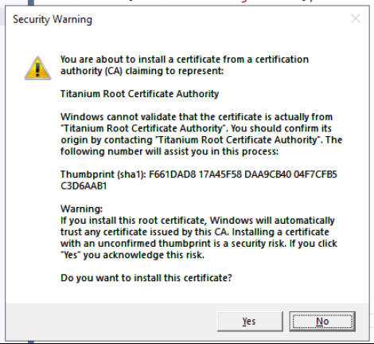

Developer Notes
===============

## Creating a new OIOIDWS.Net.Core release

### Update documentation

Ensure documentation is updated with the changes.

### Run tests

All unit and integration tests must pass prior to releasing.
Notes:
While running integration tests that require to start a HTTP proxy, it may ask you to install the Root CA certificate of the Titanium library:



Just click 'Yes' to install the certificate.

### Build the packages with Azure DevOps Pipeline

* Ensure API key to digitaliseringsstyrelsen's nuget account is set up correctly for the "Kombit.OioIdws.WscCore Nuget" pipeline
* Push packages to NuGet by running the "Kombit.OioIdws.WscCore Nuget" pipeline on Azure DevOps

### Build the packages with PowerShell script

* Ensure that dotnet CLI is installed
* Run the BuildPackages.ps1, setting version to a proper version number, e.g 1.0.0 and assemblyVersion to a proper version number, e.g 1.0.0.0. Use 1.0.0-alpha, 1.00-beta, etc. as version number to make a pre-release.
	* For example: .\BuildPackages.ps1 4.0.59 4.0.59.0
* Verify the packages looks good and are ready to publish
* Ensure API key to digitaliseringsstyrelsen's nuget account is ready
* Push packages to NuGet by running BuildPackages.ps1 with the switch -pushPackages and -nugetApiKey
	* For example: .\BuildPackages.ps1 4.0.59 4.0.59.0 -pushPackages -nugetApiKey digitaliseringsstyrelsen_nuget_api_key
	* The result will look like this:
	```
	PS E:\Projects\Digst.OioIdws\Build> .\BuildPackages.ps1 4.0.59 4.0.59.0 -pushPackages -nugetApiKey oy2pejwpntfc.....
	pushing package Kombit.OioIdws.WscCore
	Pushing Kombit.OioIdws.WscCore.4.0.59.nupkg to 'https://www.nuget.org/api/v2/package'...
	  PUT https://www.nuget.org/api/v2/package/
	warn : License missing. See how to include a license within the package: https://aka.ms/nuget/authoring-best-practices#licensing.,Readme missing. Go to https://learn.microsoft.com/en-us/nuget/create-packages/package-authoring-best-practices#readme learn How to include a readme file within the package.
	  Created https://www.nuget.org/api/v2/package/ 1958ms
	Your package was pushed.
	Pushing Kombit.OioIdws.WscCore.4.0.59.snupkg to 'https://www.nuget.org/api/v2/symbolpackage'...
	  PUT https://www.nuget.org/api/v2/symbolpackage/
	  Created https://www.nuget.org/api/v2/symbolpackage/ 451ms
	Your package was pushed.
	```

### Creating the new resource on digitaliser.dk

* Login on [digitaliser.dk][digitaliser] and go to the newest version of the
  [ressource][ressource].
* Choose Funktioner and click on `Opret ny version`.
* Change the metadata of the ressource accordingly, remember adding link to 
  `Azure DevOps` and the published Nuget packages.
* Publish the new version when ready.

[digitaliser]: https://digitaliser.dk/
[ressource]: http://digitaliser.dk/resource/2513426

### Change the frontpage of the group

* Login on digitaliser.dk and go to the [OIOIDWS group][group].
* Find the old promotion on the grouppage and remove it.
* Find the new promotion on the grouppage by using the ID from the URL of the
  page showing the new version.

[group]: http://digitaliser.dk/group/705156