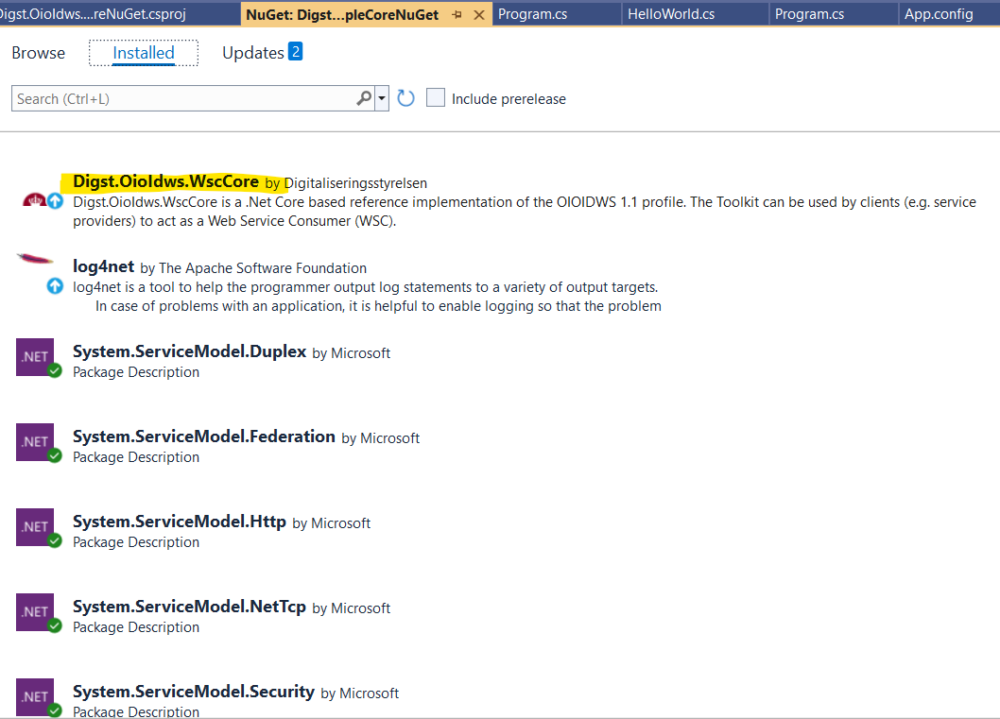

Implement .NET Core WSC applications using Digst.OioIdws.Core
===============

## Introduction

This topic outlines the steps that you can take to implement a WSC application using Digst.OioIdws.Core. The same steps can be used for porting your projects from Digst.OioIdws to Digst.OioIdws.Core. We will use the following two projects for demonstration purposes:

- Source project: https://github.com/digst/OIOIDWS.Net/tree/master/Examples/Digst.OioIdws.WscExampleNuGet
- Target project: https://github.com/digst/OIOIDWS.Net.Core/tree/master/Examples/Digst.OioIdws.WscExampleCoreNuGet

Some of the most notable changes in comparison with Digst.OioIdws are:

1. .NET Core's WCF does not support most of the XML configuration such as bindings, behaviors etc. that the .NET Framework counterpart does.
2. Digst.OioIdws.Core implement the KOMBIT STS profile that needs several new settings.

## Implementation

You can use the following steps to implement .NET Core WSC applications using Digst.OioIdws.Core:

1. Create a new .NET 6.0 project.
2. Add references to the Digst.OioIdws.WscCore package as well as other WCF packages

   

3. Since the StsTokenService has initialized many necessary WCF settings,  code to get a token can be as simple as:

    ```CSharp
    // Setup Log4Net configuration by loading it from configuration file. 
    // log4net is not necessary and is only being used for demonstration.
    XmlConfigurator.Configure();
    StsTokenServiceConfiguration stsConfiguration = TokenServiceConfigurationFactory.CreateConfiguration();

    // Retrieve token
    IStsTokenService stsTokenService = new StsTokenServiceCache(stsConfiguration);
    GenericXmlSecurityToken securityToken = (GenericXmlSecurityToken)stsTokenService.GetToken();
    Console.WriteLine("Direct token: " + securityToken.TokenXml.OuterXml);
    ```

4. To call an WSP, you will need to use the new `FederatedChannelFactoryExtensions.CreateChannelWithIssuedToken` helper method:

```CSharp
// Call WSP with token
var channelWithIssuedToken = FederatedChannelFactoryExtensions.CreateChannelWithIssuedToken<IHelloWorld>(securityToken, stsConfiguration);

try
{
    // Invoke a WSP operation which requires signature but not encryption.
    Console.WriteLine(channelWithIssuedToken.HelloSignAsync("Schultz").Result);
}
catch (Exception e)
{
    Console.WriteLine(e.Message);
    if(e.InnerException != null)
        Console.WriteLine(e.InnerException.Message);
}
```

Check out the Digst.OioIdws.WscExampleCore.Program.cs file for a complete example.

## Configuration

To make code written in the previous section work, your application needs the following configuration block in an `app.config` or `web.config` file:

```XML
<oioIdwsWcfConfiguration  debugMode="false"
                          stsEndpointAddress="https://adgangsstyring.eksterntest-stoettesystemerne.dk/runtime/services/kombittrust/14/certificatemixed"
                          stsEntityIdentifier="https://saml.adgangsstyring.eksterntest-stoettesystemerne.dk/runtime/"
                          tokenLifeTimeInMinutes="5"
                          wspEndpointID="https://wsp.oioidws-net.dk/"
                          wspEndpoint="https://digst.oioidws.wsp:9899/HelloWorld"
                          wspSoapVersion="1.1"
                          cvr="12345679"
                          includeLibertyHeader="true"
                          maxReceivedMessageSize="256000">
    <clientCertificate findValue="a402bb172929ae0d0ada62f6864329c35dc29483"
                       storeLocation="LocalMachine"
                       storeName="My"
                       x509FindType="FindByThumbprint"/>
    <stsCertificate findValue="8081b09446a396ba0ff9b7159d07d8c90f7db9ae"
                    storeLocation="LocalMachine"
                    storeName="TrustedPeople"
                    x509FindType="FindByThumbprint"/>
    <serviceCertificate findValue="ca30025a4981147505b8d7a59052ac40c7033688"
                        storeLocation="LocalMachine"
                        storeName="TrustedPeople"
                        x509FindType="FindByThumbprint"/>
  </oioIdwsWcfConfiguration>

<oioIdwsLoggingConfiguration logger="Digst.OioIdws.WscExampleCoreNuGet.Log4NetLogger, Digst.OioIdws.WscExampleCoreNuGet"/>
```

in which:

- oioIdwsWcfConfiguration: specifies the STS and WSP to call
  - debugMode: If set to true the call timeout to the STS is set to 1 day. This is needed when a developer wants to do debugging and needs more than 1 minute to do the debugging.
  - stsEndpointAddress: The STS' endpoint address that your application needs to call to get a token.
  - stsEntityIdentifier: Entity identifier of the STS that your application needs to call to get a token.
  - tokenLifeTimeInMinutes: Token life time can be specified in minutes. Default life time is chosen by STS if nothing is specified (8 hours according to the specification at the time of this writing). If specified, according to specification the STS is not obligated to honor this range and may return a token with a shorter life time in RSTR. All values above 480 minutes (8 hours) will result in a token life time of 8 hours.
  - wspEndpointID: Entity ID of an WSP
  - wspEndpoint: The WSP's endpoint address that your application can call
  - wspSoapVersion: The specific SOAP version to call the WSP. Supported values include "1.1" and "1.2". If it is not specified, the default value "1.1" is used.
  - cvr: Specifies that CVR value of your organization which is required by KOMBIT STS. This CVR is sent to the STS as a claim of type `dk:gov:saml:attribute:CvrNumberIdentifier`.
  - includeLibertyHeader: If set to true, the SOAP envelop to call WSP will include a Liberty Header which is required by many OioIdws-compliant services. However, the latest version of the OioIdws profile no longer mandates this header. If the attribute is not set, the default value is `false`.
  - maxReceivedMessageSize: Specifies max size of message received in bytes. If not set, default value of the `TransportBindingElement.MaxReceivedMessageSize` class is used. You should set this setting to a big enough value that meets your needs. Setting it to a too big value such as `int.MaxValue` makes your application vulnerable to DoS attack.
- clientCertificate: points to the certificate that your application uses to authenticate with the STS and the WSP. This certificate must have a private key.
- stsCertificate: points to the certificate of the STS that your application needs to call. Only the public key is needed.
- serviceCertificate: points to the certificate of the WSP that your application needs to call. Only the public key is needed.

## Initialize Configuration by code

You can initialize the Configuration object by code and eliminate the use of `app.config` file completely. Check out the Digst.OioIdws.WscExampleCoreWithCode.Program.cs file for a complete example.

```CSharp
Configuration wscConfiguration = new Configuration
{

    StsEndpointAddress = "https://n2adgangsstyring.eksterntest-stoettesystemerne.dk/runtime/services/kombittrust/14/certificatemixed",
    StsEntityIdentifier = "https://saml.n2adgangsstyring.eksterntest-stoettesystemerne.dk/runtime",
    StsCertificate = new Certificate
    {
       StoreLocation = System.Security.Cryptography.X509Certificates.StoreLocation.LocalMachine,
       StoreName = System.Security.Cryptography.X509Certificates.StoreName.TrustedPeople,
       X509FindType = System.Security.Cryptography.X509Certificates.X509FindType.FindByThumbprint,
       FindValue = "7002cf221d1d3979eca623599e43e0b6b4c8920c"
    },

    WspEndpoint = "https://kombitwsp12.azurewebsites.net/HelloWorld.svc",
    WspEndpointID = "http://wsp12.oioidws-net.dk/service/service/1",
    WspSoapVersion = "1.2",
    ServiceCertificate = new Certificate
    {
        StoreLocation = System.Security.Cryptography.X509Certificates.StoreLocation.LocalMachine,
        StoreName = System.Security.Cryptography.X509Certificates.StoreName.TrustedPeople,
        X509FindType = System.Security.Cryptography.X509Certificates.X509FindType.FindByThumbprint,
        FindValue = "ca30025a4981147505b8d7a59052ac40c7033688"
    },
    ClientCertificate = new Certificate 
    {
        StoreLocation = System.Security.Cryptography.X509Certificates.StoreLocation.LocalMachine,
        StoreName = System.Security.Cryptography.X509Certificates.StoreName.My,
        X509FindType = System.Security.Cryptography.X509Certificates.X509FindType.FindByThumbprint,
        FindValue = "79cfb7a45b74f4c64ea408503002df7d1143ef40"
    },

    Cvr = "11111111",
    TokenLifeTimeInMinutes = 5,
    IncludeLibertyHeader = true,
};

StsTokenServiceConfiguration stsConfiguration = TokenServiceConfigurationFactory.CreateConfiguration(wscConfiguration);
// Retrieve token
IStsTokenService stsTokenService = new StsTokenServiceCache(stsConfiguration);
GenericXmlSecurityToken securityToken = (GenericXmlSecurityToken)stsTokenService.GetToken();
Console.WriteLine("Direct token: " + securityToken.TokenXml.OuterXml);
```

## Add service reference

In order to add service reference to an OIOIDWS WSP from Visual Studio, your machine needs to have `dotnet-svcutil` version 2.1.0 or newer. You can update the tool to the latest version using the following command:

```CMD
dotnet tool install --global dotnet-svcutil
```

Reference: https://learn.microsoft.com/en-us/dotnet/core/additional-tools/dotnet-svcutil-guide?tabs=dotnetsvcutil2x

## Customize Replay attack cache

The 

```CSharp
var replayAttackCache = new MemoryCache("CustomReplayAttackCache", new NameValueCollection { { "pollingInterval", "00:00:30" } });

StsTokenServiceConfiguration stsConfiguration = TokenServiceConfigurationFactory.CreateConfiguration(replayAttackCache);
```

## Customize certificate validation

The library uses [.NET Core's IDistributedCache](https://learn.microsoft.com/en-us/aspnet/core/performance/caching/distributed?view=aspnetcore-7.0) to cache STS' tokens and WSP's responses to detect replay attacks. By default, the [in-memory cache](https://learn.microsoft.com/en-us/aspnet/core/performance/caching/distributed?view=aspnetcore-7.0#distributed-memory-cache) is used.

The code snippet below shows how to use a distributed SQL Server cache:

```CSharp
var serviceCollection = new ServiceCollection().AddDistributedSqlServerCache(...);
ServiceProvider serviceProvider = serviceCollection.BuildServiceProvider();
var replayAttackCache = serviceProvider.GetService<IDistributedCache>();

StsTokenServiceConfiguration stsConfiguration = TokenServiceConfigurationFactory.CreateConfiguration();
stsConfiguration.ReplayAttackCache = replayAttackCache;
```

If you want to disable replay attack detection, you can write an implementation of the IDistributedCache interface, make sure the `byte[]? Get(string key)` method always return null.

```CSharp
public class NoReplayAttackDetectionCache : IDistributedCache
{
    public byte[]? Get(string key)
    {
        return null;
    }

    public Task<byte[]?> GetAsync(string key, CancellationToken token = default)
    {
        return Task.FromResult<byte[]?>(null);
    }

    public void Set(string key, byte[] value, DistributedCacheEntryOptions options)
    {
    }

    public Task SetAsync(string key, byte[] value, DistributedCacheEntryOptions options, CancellationToken token = default)
    {
        return Task.CompletedTask;
    }
}
```

## Customize certificate validation

Certificate validations are controlled by the following properties of the `StsTokenServiceConfiguration` class:

```CSharp
public X509ServiceCertificateAuthentication StsCertificateAuthentication { get; } = new X509ServiceCertificateAuthentication();

public X509ServiceCertificateAuthentication WspCertificateAuthentication { get; } = new X509ServiceCertificateAuthentication();

public X509ServiceCertificateAuthentication SslCertificateAuthentication { get; } = new X509ServiceCertificateAuthentication();
```

The default behaviors are:

- Validation of the STS' and WSP's certificates reports an error when they are revoked or when building chain trust is not successful.
- Validation of the SSL certificates reports an error only when building chain trust is not successful, but not when they are revoked. This has always been the default behavior of WCF, as noted in Microsoft's documentation: https://learn.microsoft.com/en-us/dotnet/framework/wcf/feature-details/cert-val-diff-https-ssl-over-tcp-and-soap.

If you want an error to be raised when SSL certificates are revoked, you need to configure your code to do so:

```CSharp
stsTokenServiceConfiguration.SslCertificateAuthentication.CertificateValidationMode = System.ServiceModel.Security.X509CertificateValidationMode.Custom;
stsTokenServiceConfiguration.SslCertificateAuthentication.CustomCertificateValidator = X509CertificateValidatorFactory.ChainTrust;
```

To disable validation:

```CSharp
stsTokenServiceConfiguration.SslCertificateAuthentication.CertificateValidationMode = System.ServiceModel.Security.X509CertificateValidationMode.None;
```

To use PeerTrust validation:

```CSharp
stsTokenServiceConfiguration.SslCertificateAuthentication.CertificateValidationMode = System.ServiceModel.Security.X509CertificateValidationMode.PeerTrust;
```

To use a custom validator:

```CSharp
stsTokenServiceConfiguration.SslCertificateAuthentication.CertificateValidationMode = System.ServiceModel.Security.X509CertificateValidationMode.Custom;
stsTokenServiceConfiguration.SslCertificateAuthentication.CustomCertificateValidator = [Your custom validator];
```

Customization of revocation checks of the STS and WSP's certificates can be done in the same way.
